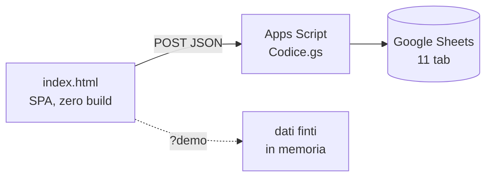

# TripHub

Organizzare un viaggio di gruppo significa tenere insieme voli, alloggi, chi ha
anticipato cosa e cosa si fa una volta arrivati. Di solito finisce in tre chat
diverse e un foglio Excel che apre solo chi l'ha fatto.

TripHub è una web app che tiene tutto in un posto solo: **niente account, niente
installazione, niente server**. Si entra con un codice, si condivide il codice con
gli altri, e si lavora sugli stessi dati.

**▶️ [Provala](https://gioveadepto.github.io/TripHub/?demo)** — la demo gira
interamente nel browser con dati inventati, non serve nessun codice.

<!-- Aggiungi due o tre schermate qui: valgono più di mille parole.
     Mettile in una cartella docs/ e scommenta:


-->

---

## Cosa fa

| | |
|---|---|
| ✈️ **Voli** | Più opzioni a confronto, scali, durata reale calcolata sui fusi orari degli aeroporti |
| 🏠 **Alloggi** | Opzioni con voto, prezzi derivati (a notte, a testa, a testa/notte), avviso sulle notti scoperte |
| 💶 **Budget** | Preventivo, chi ha anticipato cosa, saldi e **conguaglio semplificato** |
| 📅 **Cose da fare** | Prima le idee senza data, poi il calendario — con un **suggeritore** di quando farle |
| 🧳 **Valigia** | Liste con modelli pronti, aggiunta rapida, spunta per persona |
| ☎️ **Contatti e info** | Numeri utili, informazioni sulla destinazione |
| 🖨 **Esportazioni** | Dossier PDF del viaggio, file `.ics` per il calendario del telefono |
| 📧 **Promemoria** | Ogni lunedì un'email con quello che manca: scelte, prenotazioni, scadenze, chi deve a chi |

---

## Le parti che vale la pena guardare

Se apri il codice per curiosità, queste tre sono le più interessanti.

### Conguaglio dei debiti

Il tab Budget non si limita a dividere il totale. Tiene separate due cose che è
facile confondere:

```
COSTI      voli scelti + alloggi scelti + spese   → il preventivo
MOVIMENTI  anticipi e rimborsi                    → chi deve a chi
```

Un alloggio prenotato che si paga fra tre mesi sta nel preventivo ma **non** nei
saldi: nessuno ha ancora messo soldi, quindi nessuno deve niente. Quando qualcuno
paga — anche solo la caparra — registra un *anticipo*; quando gli altri
restituiscono la loro parte, anche solo parziale, un *rimborso*.

Sui saldi netti gira poi la semplificazione dei debiti: invece di far pagare
ognuno a ognuno, chi è in rosso paga direttamente chi è in verde, partendo ogni
volta dal debito e dal credito più grossi. Ne escono al massimo **n−1 bonifici**
invece dei n×(n−1)/2 possibili.

> Trovare il numero *minimo assoluto* di bonifici è un problema NP-difficile.
> Questo è l'algoritmo greedy (min cash flow), lo stesso usato da Splitwise: in
> pratica il risultato coincide quasi sempre con l'ottimo, ma non è un ottimo
> dimostrato.

`simplifyDebts()` e `computeSettlement()` in [`index.html`](index.html).

### Suggeritore di orari

Un'attività non deve avere per forza una data: prima la censisci (cosa è, quanto
dura, in che fascia oraria ha senso), poi decidi quando farla. Il pulsante ✨
propone i tre giorni migliori con l'orario, incrociando:

- le date del viaggio e gli **orari dei voli scelti** — il giorno di arrivo parte
  un'ora e mezza dopo l'atterraggio, quello di partenza chiude tre ore prima del
  decollo
- i buchi liberi della giornata, con mezz'ora di respiro fra un'attività e l'altra
- quanto è già carico quel giorno, la fascia oraria preferita, il tipo e la zona
  delle attività già fissate

`cdfSlotFor()`, `cdfScoreDay()` e `cdfSuggest()`. C'è anche una pianificazione in
blocco greedy che parte dalle attività più vincolanti.

### Durate dei voli con i fusi veri

Gli orari di partenza e arrivo sono sempre ora locale dell'aeroporto. Sommarli
così com'erano dava durate sbagliate di un'ora o più su ogni tratta
internazionale. Ogni orario viene convertito nell'istante UTC reale usando il fuso
IANA dell'aeroporto (che porta con sé anche l'ora legale), e la durata torna
quella vera. Se un aeroporto non è in tabella l'app **lo dice**, invece di fingere.

---

## Architettura



Tre file, nessuna dipendenza da installare, nessun passo di build: **il deploy è
copiare dei file**. Bootstrap e i font arrivano da CDN, tutto il resto è scritto a
mano.

| File | | |
|---|---:|---|
| [`index.html`](index.html) | 6.600 righe | tutta la SPA: routing, viste, form, PDF, ICS, demo |
| [`Codice.gs`](Codice.gs) | 1.330 righe | Web App Apps Script: CRUD, controllo accessi, batch, promemoria email |
| [`style.css`](style.css) | 585 righe | |
| [`test.html`](test.html) | 350 righe | i test, senza framework |

### Perché un solo file da 6.600 righe

È una scelta, non una resa. Il pregio di questo progetto è che si aggiorna
copiando un file: niente `node_modules`, niente bundler, niente pipeline che fra
due anni non compila più. Spezzarlo per igiene costerebbe quel pregio senza
restituire nulla di misurabile a questa scala. Il CSS è stato tirato fuori perché
il browser possa tenerlo in cache separatamente dall'HTML, che cambia di continuo.

Il rovescio della medaglia è reale e vale la pena dirlo: navigare il file richiede
la ricerca, e non c'è tree-shaking. A una scala più grande la risposta sarebbe
diversa.

### Come sono organizzati i dati

Un foglio Google fa da database, un tab per entità. Le colonne nuove vengono
**sempre aggiunte in coda**, così i fogli esistenti non si disallineano mai:
`headers()` confronta lo schema con il foglio e crea da sé quel che manca.

I tab principali: `Viaggi`, `Partecipanti`, `Voli`, `Alloggi`, `Spese`,
`Pagamenti`, `CoseDaFare`, `CosaPortare`, `Contatti`, `InfoDest`, più una
`Rubrica` globale.

Qualche dettaglio non ovvio:

- **Accesso**: due ruoli. Un codice amministratore apre tutto; un codice viaggio
  apre solo quel viaggio, e il filtro lo fa il server — il resto dei dati non
  arriva nemmeno al browser.
- **Il codice viene risolto una volta sola**: senza cache ogni richiesta rileggeva
  l'intero tab `Viaggi` solo per capire chi sei. Ora sta in `CacheService`, con un
  namespace in `ScriptProperties` che viene incrementato a ogni scrittura sui
  viaggi, così un codice cambiato ha effetto **subito** e non a scadenza.
- **Scritture in blocco**: `create_many` e `update_many` fanno una lettura e una
  scrittura sola. Con `update` riga per riga, pianificare otto attività avrebbe
  significato otto invocazioni dello script in fila.
- **Colonne tipizzate a mano**: date, orari, PNR e numeri di telefono sono forzati
  a testo, altrimenti Sheets sfasa i giorni e mangia gli zeri iniziali.
- **Aggiornamenti ottimistici**: dopo un salvataggio si aggiorna la copia in
  memoria e si ridisegna solo la sezione corrente, senza rifare la chiamata piena.

---

## Installazione

Serve un account Google. Dieci minuti.

1. **Crea un foglio** Google vuoto.
2. **Estensioni → Apps Script**, incolla il contenuto di [`Codice.gs`](Codice.gs).
3. Esegui una volta la funzione **`setupSheets()`**: crea tutti i tab con le
   colonne giuste. Va rieseguita dopo ogni aggiornamento che aggiunge colonne.
4. **Impostazioni progetto → Proprietà script**, aggiungi `API_TOKEN` con il
   codice amministratore che vuoi.
5. **Distribuisci → Nuova distribuzione → App web**, esegui come *te stesso*,
   accesso a *chiunque*. Copia l'URL.
6. Incolla l'URL in `API_URL`, in cima allo `<script>` di
   [`index.html`](index.html).
7. Pubblica `index.html`, `style.css`, `icon.svg` e `manifest.json` dove vuoi —
   GitHub Pages va benissimo, è tutto statico.

I codici di accesso dei singoli viaggi si generano dall'app quando crei un
viaggio.

**Promemoria via email** — facoltativo. Dall'editor esegui una volta
`installDigestTrigger()`: ogni lunedì alle 8 i partecipanti (e tu) ricevono un
riassunto di quello che manca per ciascun viaggio non ancora concluso. Se non
c'è niente da dire, non manda niente. Per vedere cosa manderebbe senza spedire:
`previewDigest()`. Per spegnerlo: `removeDigestTrigger()`.

**Se aggiorni da una versione precedente** che salvava i numeri dei documenti:
`purgeDroppedColumns()` svuota quelle colonne nel foglio. L'app ha già smesso di
leggerle e scriverle a prescindere, ma i dati vecchi restano lì finché non lo
lanci.

---

## Sviluppo e test

Serve un server locale, perché `file://` blocca l'accesso all'iframe dei test:

```bash
python -m http.server 8000
```

- `http://localhost:8000/?demo` — l'app con dati finti, **senza backend**. Tutta
  la rete passa da `api()`, quindi la modalità demo è un intercettore su
  quell'unica funzione. Serve anche per sviluppare senza toccare il foglio vero.
- `http://localhost:8000/test.html` — i test.

I test non hanno framework né dipendenze: la pagina carica `index.html?demo` in un
iframe e verifica le funzioni pure contro il suo `window`. Coprono conversioni di
date e durate, il conguaglio dei debiti, il suggeritore di orari, la generazione
ICS e la validazione dei link. Sono **84** e sono stati verificati con quattro
mutazioni deliberate del codice, per assicurarsi che sappiano fallire.

---

## Limiti noti

Le cose che so che non vanno, dette prima che le scopra qualcun altro.

- **Vince l'ultimo che scrive.** Un `LockService` impedisce le corse fra scritture
  concorrenti, ma non c'è controllo di versione sulla riga: se due persone
  modificano la stessa voce insieme, una delle due modifiche sparisce in silenzio.
  Per un'app che usa un gruppo di amici è un compromesso accettabile, per una vera
  app multiutente no.
- **Nessun tempo reale.** I dati si aggiornano quando premi ⟳ o quando torni sulla
  scheda dopo un minuto. Non c'è push.
- **La sicurezza è un codice condiviso.** Chi ha il codice del viaggio vede tutto
  quel viaggio. I codici girano su WhatsApp e non scadono. Per questo l'app **non
  salva numeri di documento né codici fiscali**: tiene solo tipo e scadenza, che
  sono l'unica cosa che le serve (per l'avviso "scade prima del rientro").
- **Annullare vale solo per le eliminazioni**, non per le modifiche.
- **Apps Script non è veloce.** Una risposta sta fra uno e tre secondi. La cache in
  memoria e gli aggiornamenti ottimistici servono a non farlo pesare, non a
  risolverlo.

## Licenza

[MIT](LICENSE).
